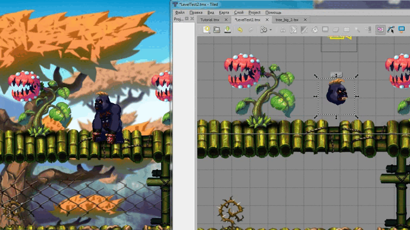

# AnimatedTiles
A new TMXAnimation class that supports tile animation of TMX tiledmap in layer-level, based on cocos2dx 3.17.2

# To support animated tiles in your project, you need:
1. Copy files CCTMXAnimation.cpp , CCTMXAnimation.h
in the directory C:\Cocos\projects\JawsClaws\cocos2d\cocos\2d

2. replace files CCFastTMXLayer.cpp , CCTMXXMLParser.cpp , CCTMXXMLParser.h.
in the directory C:\Cocos\projects\JawsClaws\cocos2d\cocos\2d
or
and make changes to the files CCFastTMXLayer.cpp , CCTMXXMLParser.cpp , CCTMXXMLParser.h.
in the directory C:\Cocos\projects\JawsClaws\cocos2d\cocos\2d


**File CCFastTMXLayer.cpp**

line 49 add header file connection
```
#include "2d/CCTMXAnimation.h"
```
line 110, add the following code before the return statement
```
// animate tile
TMXAnimation *animation = tilesetInfo->_animation;
if (animation)
       animation->initAnimation(this, _layerSize);
```

**File CCTMXXMLParser.h**

line 47 add forward declarations
```
class TMXAnimation;
```
line 149 add a pointer to TMXAnimation immediately after std::string _original source image

```
// pointer to the tile animation class
TMXAnimation *_animation;
```
**File CCTMXXMLParser.cpp**

line 677 after the code
```
        dict["polylinePoints"] = Value(pointsArray);
    }
}
```
add code to process information about animated tiles
```
else if (elementName == "animation")
{
       if (tmxMapInfo->getParentElement() == TMXPropertyTile)
       {
              TMXTilesetInfo *info = tmxMapInfo->getTilesets().back();
              if (!info->_animation)
              {
                     TMXAnimation *animation = TMXAnimation::create();
                     CC_SAFE_RETAIN(animation);
                     info->_animation = animation;
              }
              uint32_t gid = tmxMapInfo->getParentGID();
              info->_animation->addAnamationInfo(gid);
              tmxMapInfo->setParentElement(TMXPropertyAnimation);
       }
}
else if (elementName == "frame")
{
       if (tmxMapInfo->getParentElement() == TMXPropertyAnimation)
       {
              TMXTilesetInfo *info = tmxMapInfo->getTilesets().back();
              uint32_t tiledId = info->_firstGid + attributeDict["tileid"].asInt();
              uint32_t duration = attributeDict["duration"].asInt();
              info->_animation->addFrameInfo(tiledId, duration);
       }
}
```

# How To Use
Use the cocos2d-x cocos2d::experimental::TMXTiledMap class
```
auto map = cocos2d::experimental::TMXTiledMap::create(levelPath);
```

# ShowCase

